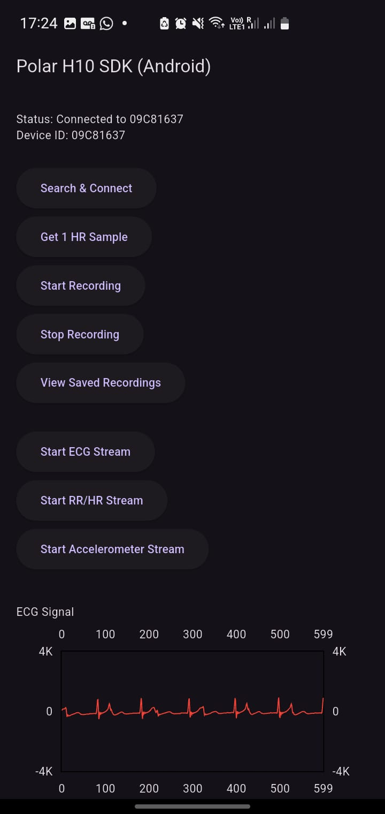
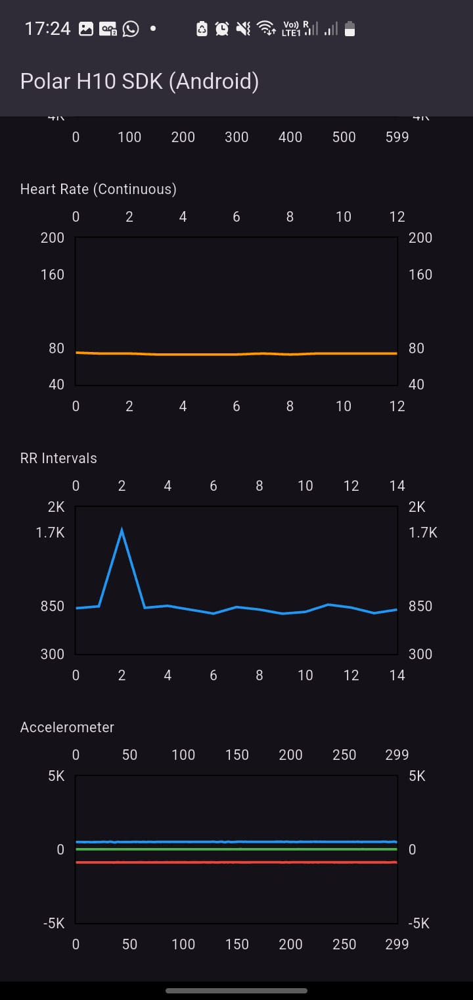
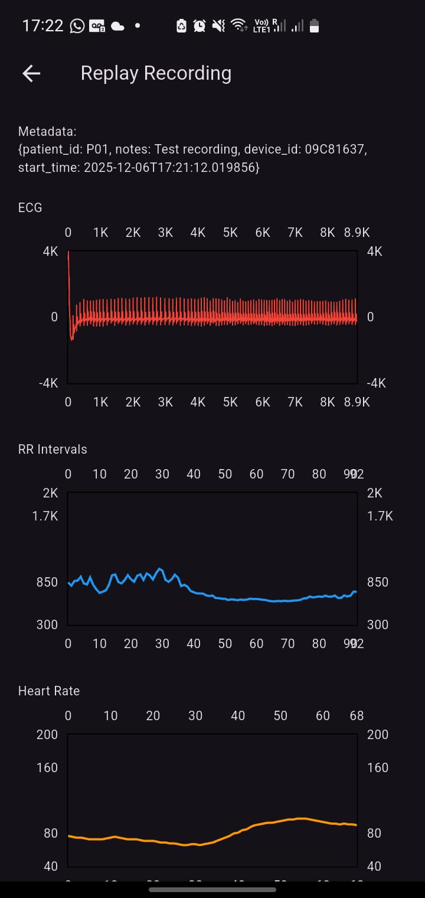
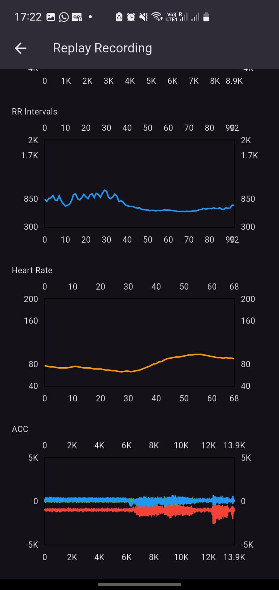
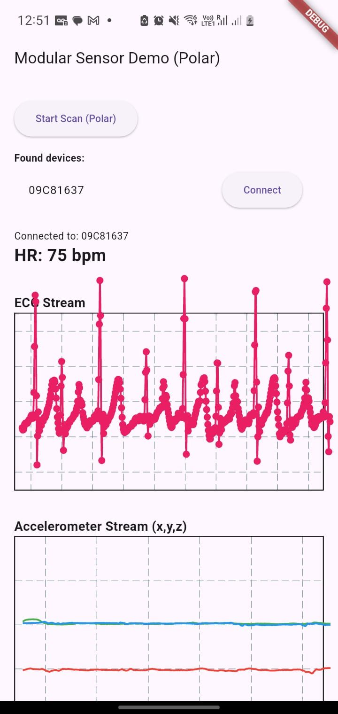

# ans_multi


**Autonomic Nerve System for Multiple Relevant Sensors**

## Overview

`ans_multi` is a Flutter-based Android application designed to support **modular, multi-sensor integration** for autonomic nervous system data collection. The project currently supports Polar sensors (Polar H10) and is currently developed to allow additional sensors' Android SDKs to be added with minimal changes.

## Developer Notes

- Native Android code and Flutter code communicate through **MethodChannels and EventChannels**.
- Flutter Version = 3.35.6
- Dart Version = 3.9.2
- Gradle Version = 8.12
- Android Gradle Plugin (AGP) = 8.9.1
- Kotlin Android Plugin = 2.1.0
- Minimum Android SDK = API 26 (Required by Polar BLE SDK 6.10.0)
   > Compatible with Android 8.0+
- Polar BLE SDK Version = 6.10.0
- Look into the code and understand the syntax (e.g. android side imports, file structure imports, event/method channels, etc.)

Recommended Resources:

- IDE Setup:
   - Here's a guide for setting up flutter on Android Studio (Windows): [How to install Flutter on Windows 2025](https://youtu.be/mMeQhLGD-og?si=0WOnbwKWNU3zz16q)
   - [Official Flutter Install Guide](https://docs.flutter.dev/install/manual)
   - Flutter side debugging tips:
      - run this to refresh/sync files
      ```dart
        flutter clean
        flutter pub get
      ```
   - Android side debugging tips:
      - Make sure to use Gradle Sync to sync all your files (on Android Studio, open your project's android folder in a new window then you can find the gradle sync button)
      - Once you're done running the Gradle Sync, you should be able to see all the libraries you imported under `External Libraries` all the way at the bottom of the folder structure on Android Studio.
      - check this for debugging: [The Full Guide to Debugging Your Android Apps - Android Studio Tutorial](https://youtu.be/ln5hc-zprEM?si=pJh6Nr7N0Thkm1jA)

- Flutter:
   - [Official Introduction to Dart](https://dart.dev/language)
   - [Asynchronous Programming in Dart: Tutorial](https://dart.dev/codelabs/async-await)
   - [Asynchronous Programming in Dart: Using Streams](https://dart.dev/tutorials/language/streams)
   - [Flutter's Online Documentation (Flutter-specific patterns)](https://docs.flutter.dev/)
   - [Official Flutter Platform Channels Guide](https://docs.flutter.dev/platform-integration/platform-channels)
   - [Lab: Write your first Flutter app](https://docs.flutter.dev/get-started/codelab)
   - [Cookbook: Useful Flutter samples](https://docs.flutter.dev/cookbook)

- Android:
   - [Kotlin Language Basics](https://kotlinlang.org/docs/home.html)
   - [Android Fundamentals](https://developer.android.com/guide)
   - [Android Gradle Basics](https://developer.android.com/build)

- Misc:
   - [Interfaces and Abstract Classes in Dart](https://dart.dev/language#interfaces-and-abstract-classes)
   - [YouTube Video: Learn INTERFACES in 6 minutes! 📋](https://youtu.be/c2sTQk9opO8?si=ZtixFgWaC6yR-Mwv)


#### Polar H10 Android SDK Dependencies
Everything is in these 3 files (based on [Polar BLE SDK: Android Getting Started](https://github.com/polarofficial/polar-ble-sdk#android-getting-started)):
- `android/build.gradle.kts`
- `android/app/build.gradle.kts`
- `android/app/src/main/AndroidManifest.xml`

## Current Progress

_**10/03/2025 - 12/12/2025**_

### Polar-Only App:

- Implemented Polar H10 into app called “Untitled” (in the [ans_polar_only](https://github.com/matthewivan/ans_multi/tree/ans_polar_only) branch).
- App can graph ECG, Heart Rate, Accelerometer, and RR intervals
- Has a feature to save recording of data and look back at it
- Demo:
<p align="center">
   
   
   
   
</p>

### Multi-Sensor App:

- Functional multi-sensor framework that can implement more than one SDK modularly (in the [master](https://github.com/matthewivan/ans_multi/tree/master) branch).
- Can connect to Polar H10 and graph ECG and Accelerometer data
- Has capability to connect to additional sensors if SDK is properly implemented
- Demo:
<p align="center">
   
</p>

## Future Work

- All capabilities within Polar H10 app need to be implemented into Mutli-Sensor App
- RR intervals and Heart Rate need to be able to be graphed
- Implementation of Vivalink sensor using its SDK
- UI has been created (should be found in Github Repository) but needs to be implemented into mutlisensor architecture
- A profile for a specific client should be able to be made prior to recording
- Should save recording as the name of patient and date of recording
- Needs save feature

# Flutter ↔ Android Sensor Architecture

## High-Level Goal

This system is designed to:
- Integrate native Android sensor SDKs (Polar BLE SDK, etc.) into Flutter
- Support multiple sensors and multiple devices cleanly
- Avoid hard-coding vendor logic into Flutter UI
- Stream high-frequency real-time data safely and efficiently
- Remain extensible (add Vivalink, mock sensors, etc.)

At a high level:
> Flutter sends commands. Android sends sensor data back as streams.  
> Both sides use the same sensor name to stay connected.

To achieve that, the system is split into three layers:
```
[Layer 1] Flutter UI
   ↓
[Layer 2] Flutter Sensor Abstractions
   ↓
[Layer 3] Flutter ↔ Android Channels
   ↓
[Native] Android Sensor Plugins → Native SDKs
```


## Layer 1: Flutter UI

**Purpose:**  
- Display data and handle user interaction.

**What this layer does:**
- Shows device lists
- Displays heart rate, ECG, accelerometer graphs
- Reacts to incoming data automatically

**What this layer does *not* do:**
- Does not talk to Bluetooth
- Does not know about Polar SDK
- Does not know about Android channels

This layer only consumes **Dart streams**.


## Layer 2: Flutter Sensor Abstractions (Flutter-side logic)

**Purpose:**  
- Provide a clean, sensor-agnostic API for the UI.
- This layer sits between the UI and the platform.

**Core responsibilities**
- Expose sensor actions (`startScan`, `connect`)
- Expose sensor data as Dart streams (`hr`, `ecg`, `acc`)
- Hide platform-specific details

**Key files**
- `sensor_interface.dart` → defines what *every* sensor must support
- `polar_sensor.dart` → Flutter wrapper for a Polar sensor
- `sensor_manager.dart` → registry that stores sensors by name

The UI only talks to **this layer**, never directly to Android.


## Layer 3: Flutter ↔ Android Communication (The bridge)

**Purpose:**  
- Move information between Flutter and Android safely and clearly.

This layer uses two channel types:

**Communication Types**

| Purpose | Channel | Direction | Examples |
|------|--------|----------|---------|
| Commands | MethodChannel | Flutter → Android | startScan, connect, startEcg |
| Data streams | EventChannel | Android → Flutter | HR, ECG, ACC samples |

- **MethodChannel** = “Do something”
- **EventChannel** = “Here is continuous data”


## Android Side: Android Sensor Plugins → Native SDKs

**Purpose:**  
Talk directly to native sensor SDKs.

**Key files**
- `PolarSensor.kt` handles:
  - scanning
  - connecting
  - streaming HR / ECG / ACC
  - converting native data into simple maps

- `SensorPlugin.kt` defines:
  - a common interface so all sensors behave the same way.

- `SensorChannelRegistrar.kt` wires:
  - Flutter method calls → sensor functions
  - sensor events → Flutter event streams

MainActivity only **creates sensors and registers channels**.  
It does not handle sensor logic.


## Naming Convention

Each sensor instance has a **name**, for example:

| Item | Example |
|----|----|
| Sensor name | `polar1` |
| Method channel | `sensors/polar1/methods` |
| Event channel | `sensors/polar1/events` |
| Registry key | `"polar1"` |

> If the name does not match everywhere, the connection breaks.

This is what allows:
- multiple sensors
- multiple devices
- clean routing without special cases


## Interface-Driven Design (Vendor Agnostic)

Both sides define interfaces, not concrete implementations. This essentially means "any sensor must at least be able to do all the functions defined in the interfaces". Thus, you can still add vendor/sensor-specific functions to your sensor classes. This is not perfect yet and will need more modifications for the interfaces to be properly generic. Please generalize them better, thank you.
- [Interfaces and Abstract Classes in Dart](https://dart.dev/language#interfaces-and-abstract-classes)
- [YouTube Video: Learn INTERFACES in 6 minutes! 📋](https://youtu.be/c2sTQk9opO8?si=ZtixFgWaC6yR-Mwv)

Android
```kt
interface SensorPlugin {
    val name: String
    fun initialize()
    fun startScan()
    fun connect(id: String)
    fun startEcg(id: String)
    fun startAcc(id: String)
    fun setEventSink(...)
}
```

Flutter
```dart
abstract class SensorInterface {
  String get name;
  Future<void> startScan();
  Future<void> connect(String id);
  Stream<T> getStream<T>(String type);
}
```

This allows:
- Swapping Polar for Vivalink
- Adding simulated sensors
- Testing without BLE hardware
- Reusing UI widgets unchanged


## End-to-End Flow
| Step | What happens |
|----|----|
| App starts | Sensors are registered by name |
| User taps Scan | Flutter → Android (MethodChannel) |
| Device found | Android → Flutter (EventChannel) |
| User connects | Flutter → Android |
| Start ECG / ACC | Flutter → Android |
| Sensor data streams | Android → Flutter |
| UI updates | Automatically via streams |


# Code Overview

## Android 

**Path:** `android/app/src/main/kotlin/com/ans/ans_multi`

#### `MainActivity.kt`

This is the Android native entry point of the Flutter app. It requests Bluetooth permissions, creates and initializes a sensor and registers its method/event channels so Flutter can talk to it. It wires the Flutter engine to your native sensor plugins and manages their lifecycle on Android.

#### _Sensors Folder_

- **`PolarSensor.kt`**  
  Integrates the Polar Android BLE SDK to scan for Polar devices, connect to them, and stream sensor data (heart rate, ECG, accelerometer), translating those events into simple maps sent to Flutter through an `EventChannel`.

- **`SensorChannelRegistrar.kt`**  
  Registers Flutter method and event channels for a given sensor using dynamic names and wiring Flutter calls to the sensor’s Android implementation. Streams sensor events from Android back to Flutter through an `EventChannel`, acting as the communication bridge.

- **`SensorPlugin.kt`**  
  Defines a common interface for all sensor integrations and specifies how they initialize, scan, connect, stream data, and send events to Flutter. This allows the app to remain vendor-agnostic.

### Flutter

**Path:** `lib/`

#### `main.dart`

End-to-end integration with a Polar sensor. Scans for devices, connects, listens for heart rate, ECG, and accelerometer streams, and visualizes the data in real time using line charts through the modular `SensorManager` and `PolarSensor` wrappers.

#### _Sensors Folder_

**Path:** `lib/sensors/`

- **`polar_sensor.dart`**  
  Flutter-side Polar sensor wrapper. Creates method and event channels matching the Android side, listens to native events, and converts them into Dart streams (device discovery, connection, HR, ECG, ACC).

- **`sensor_interface.dart`**  
  Defines the Flutter-side contract that all sensor wrappers must implement, specifying how to start scanning, connect to devices, and expose data as streams.

- **`sensor_manager.dart`**  
  Central registry and dispatcher for sensors on the Flutter side. Stores sensors by name and forwards commands such as `startScan` and `connect`, providing a unified interface for the UI.

#### _Widgets Folder_

**Path:** `lib/widgets/`

- **`acc_line_chart.dart`**  
  Listens to a stream of accelerometer samples and plots X, Y, and Z values in real time as scrolling line graphs with a fixed buffer size.

- **`live_line_chart.dart`**  
  Listens to a stream of integer samples (ECG data) and renders them as a scrolling real-time line chart, keeping only recent points to maintain performance.


## Future UI to Integrate

### Flutter

#### _Widgets Folder_

**Path:** `lib/widgets/`

- **`truepulse_logo.dart`**

Provides a branded visual element for the application by displaying a placeholder logo alongside the **TruePulse** name using the app’s primary brand color. While currently implemented with a standard icon, this widget is designed to be replaced with a custom SVG logo depicting a heartbeat rhythm transitioning into a heart. Its primary purpose is to establish brand identity and visual trust within the clinical interface.

- **`section_header.dart`**

Standardizes the appearance of section titles across the application. By encapsulating typography, spacing, and color in a reusable widget, it enforces a consistent visual hierarchy and eliminates duplicated styling logic. This widget is used to clearly separate logical sections such as patient information, physiological signals, and session controls.

- **`graph_card.dart`**

Acts as a reusable container for physiological signal visualizations. Each card presents a signal title and a styled placeholder area where real-time or recorded data will eventually be rendered. Although currently static, the widget is structured to support future integration with charting libraries, interactive elements, and timestamp markers, making it a foundational component of the monitoring interface.

#### _Theme Folder_

**Path:** `lib/theme/`

- **`truepulse_theme.dart`**

Defines the global visual identity of the application. This file centralizes all color, typography, and component styling using the TruePulse brand color (`#630436`) and Material 3 design principles. It ensures visual consistency across screens by styling app bars, cards, input fields, buttons, and floating action buttons. Any changes made here automatically propagate throughout the app, making it critical for maintaining a professional, clinical appearance.

#### _Models Folder_

**Path:** `lib/models/`

- **`patient.dart`**

Represents a patient within the application and encapsulates core demographic and historical data, including patient ID, name, date of birth, and medical history. It also provides a computed `age` getter that dynamically calculates the patient’s age based on the current date. This model is intentionally limited to data representation and contains no UI or persistence logic, allowing seamless future integration with databases or backend services.

- **`timestamp_note.dart`**

Defines a lightweight data model for notes created during a recording session. Each note consists of a timestamp and a free-text description, enabling clinicians or operators to annotate events as they occur. These notes are designed to align with physiological signal data and will later be mapped to visual markers on ECG, RR, and accelerometer graphs for retrospective analysis.

#### _Screens Folder_

**Path:** `lib/screens/`

- **`patient_session_screen.dart`**

Defines the primary working screen of the application where patient sessions are created and monitored. This screen coordinates the layout of branding elements, physiological signal placeholders, session controls, and timestamp notes. It manages session-level state, including the creation and display of timestamped notes, initiation of the 30:15 test via a functional button stub, and the display of file save timestamps. As the application evolves, this screen will serve as the central hub for real-time data visualization, recording control, and clinician review workflows.
